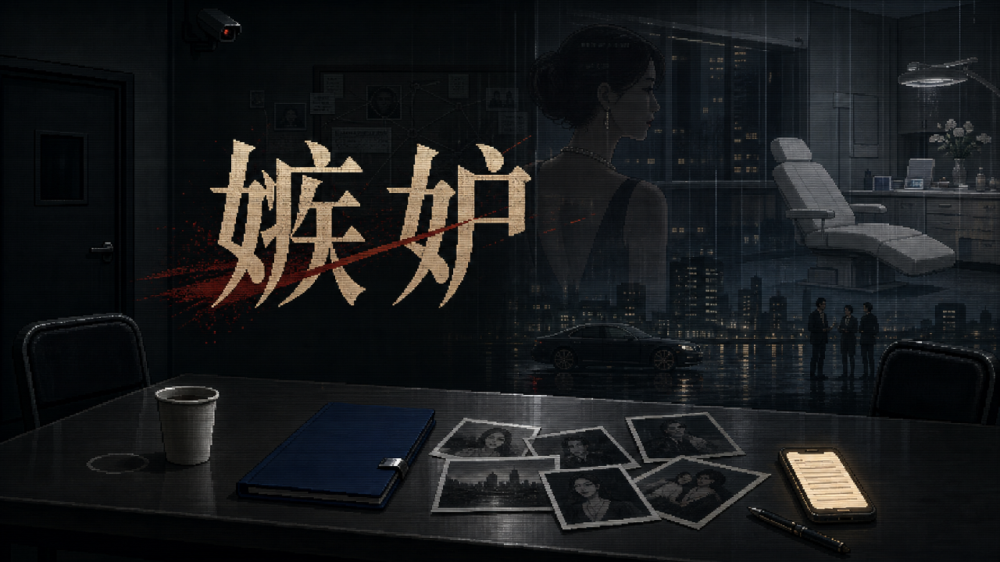

# 嫉妒 · Jealousy

> 法律真相是自杀，道德真相是一群人。

一桩发生在南海市的命案：女人死在自己的诊所里，手机备忘录写满了另一个男人的名字——"郁文知道一切"。
你是刑警刘明。七天，有限的行动，一张越铺越大的关系网。把五层真相一层层撬开——或者，看着它被按成一桩"自杀结案"。

**社会派推理 × 心理恐怖 × 调查模拟**　|　三种结局　|　通关约 60–90 分钟

## 下载

前往 **[Releases](../../releases)** 页面：

- **Windows**：下载 `Jealousy-1.0-win.zip`，解压后运行 `Jealousy.exe`
- **Mac**：下载 `Jealousy-1.0-mac.zip`，解压后**右键点击 Jealousy.app → 打开**（首次需要这样绕过未签名提示）

## 演职员表

- 主编：郁文
- 总工程师：Claude Code
- 美工：Codex

*本游戏剧情纯属虚构，与一切现实组织、机构均无任何关系。如有雷同，不胜荣幸。*
